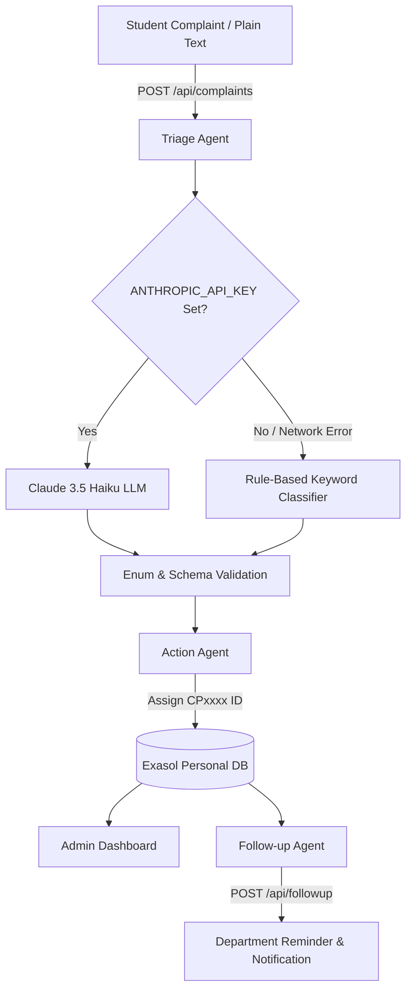

# CampusPilot

> **Autonomous Campus Operations Agent** — AI-powered complaint intake, intelligent NLP triage, automatic department routing, Exasol analytical database storage, admin dashboard, and automated ticket follow-up reminders.

---

## 📌 Table of Contents
- [Executive Summary](#-executive-summary)
- [System Architecture](#-system-architecture)
- [Agent System Breakdown](#-agent-system-breakdown)
- [Pages & User Experience](#-pages--user-experience)
- [Repository Layout](#-repository-layout)
- [Setup & Getting Started](#-setup--getting-started)
- [Environment Variables](#-environment-variables)
- [REST API Documentation](#-rest-api-documentation)
- [Database Schema](#-database-schema)
- [Testing & Verification](#-testing--verification)
- [Architectural & Reliability Design](#-architectural--reliability-design)

---

## 📌 Executive Summary

Traditional campus operations rely on manual ticket creation, phone calls, or fragmented email threads. Issues like broken projectors, Wi-Fi outages, plumbing leaks, or safety hazards often suffer from slow response times and unmonitored ticket drag.

**CampusPilot** solves this by deploying a team of autonomous logical agents:
1. **Student submits problem** in free-text plain English.
2. **Triage Agent** extracts structure (Category, Department, Location, Priority, Summary) via Claude 3.5 Haiku with automatic keyword fallback.
3. **Action Agent** generates a formatted ticket (`CP1024`) and persists it into **Exasol Personal DB**.
4. **Admin Dashboard** displays live ticket telemetry, enabling one-click resolution.
5. **Follow-up Agent** monitors stagnant open tickets and dispatches overdue reminders to assigned departments.

---

## 🏗️ System Architecture



### Architectural Principles
- **Fail-Safe Triage**: The system degrades gracefully to keyword classification if LLM service is unavailable.
- **Repository Pattern**: Business logic interacts with an abstract repository interface (`ticketsRepo.js`), enabling 100% mocked testing without Exasol.
- **Strict Data Contracting**: LLM JSON output is validated against enum constraints prior to database insertion.

---

## 🤖 Agent System Breakdown

### 1. Triage Agent ([`triageAgent.js`](file:///Users/sai/Downloads/campuspilot-main/backend/src/agents/triageAgent.js))
- **Role**: Natural language understanding & feature extraction.
- **LLM Engine**: Claude 3.5 Haiku (`claude-3-5-haiku-20241022`).
- **Validation Engine**: Validates raw JSON output against enum values:
  - **Categories**: `IT`, `MAINTENANCE`, `ACADEMIC`, `SECURITY`, `LOST_FOUND`
  - **Priorities**: `LOW`, `MEDIUM`, `HIGH`, `CRITICAL`
  - **Departments**: Short team names like `"AV Maintenance"`, `"IT Support"`, `"Campus Security"`.
- **Fallback Engine**: If `ANTHROPIC_API_KEY` is missing or LLM call/validation fails, delegates to deterministic keyword matching ([`classifier.js`](file:///Users/sai/Downloads/campuspilot-main/backend/src/agents/classifier.js)).

### 2. Action Agent ([`actionAgent.js`](file:///Users/sai/Downloads/campuspilot-main/backend/src/agents/actionAgent.js))
- **Role**: Converts validated triage results into actionable DB entities.
- **Functions**:
  - `createTicketFromTriage()`: Generates next formatted ticket key (`CP1001`, `CP1002`, ...) and writes ticket record with `status: 'OPEN'`.
  - `resolveTicket()`: Updates ticket status from `OPEN` to `RESOLVED`.

### 3. Follow-up Agent ([`followupAgent.js`](file:///Users/sai/Downloads/campuspilot-main/backend/src/agents/followupAgent.js))
- **Role**: Prevents unresolved ticket stagnation.
- **Logic**: Evaluates open tickets against `FOLLOWUP_OVERDUE_MINUTES` (default: 2 mins for demo). For overdue tickets, creates a record in `CAMPUSPILOT.FOLLOWUPS` and returns notification payload.

---

## 🌐 Pages & User Experience

- **Student Complaint Form (`/`)**: Free-form text input allowing students to report issues. Displays ticket confirmation and triage classification.
- **Admin Dashboard (`/dashboard`)**: Metric overview (Open, High Priority, Resolved count), ticket list with quick status toggle, and manual "Simulate Follow-up" trigger.
- **Ticket Detail (`/ticket/:id`)**: Detailed ticket inspector page showing category, department, location, priority badge, and current status.

---

## 📁 Repository Layout

```text
.
├── src/                        # Frontend Application (React 19 + Vite)
│   ├── assets/                 # Static visual assets
│   ├── App.css                 # Application styles & badge components
│   ├── App.jsx                 # Client-side routing table
│   ├── ComplaintPage.jsx       # Student complaint submission page (/)
│   ├── ComplaintPage.test.jsx  # Frontend unit tests for submission page
│   ├── Dashboard.jsx           # Operations dashboard page (/dashboard)
│   ├── Dashboard.test.jsx      # Frontend unit tests for dashboard
│   ├── TicketPage.jsx          # Ticket details inspection page (/ticket/:id)
│   ├── setupTests.js           # Testing Library setup
│   └── main.jsx                # React root entrypoint
├── backend/                    # Express API Backend & Exasol Database
│   ├── src/
│   │   ├── agents/             # Autonomous agent logic
│   │   │   ├── actionAgent.js   # Ticket entity creation & resolution agent
│   │   │   ├── classifier.js    # Rule-based fallback classifier
│   │   │   ├── followupAgent.js # Overdue ticket monitoring & reminder agent
│   │   │   └── triageAgent.js   # Claude 3.5 Haiku NLP triage agent
│   │   ├── db/                 # Database persistence layer
│   │   │   ├── connection.js    # Exasol WebSocket client wrapper
│   │   │   ├── migrate.js       # DDL migration execution script
│   │   │   ├── schema.sql       # SQL DDL for CAMPUSPILOT tables
│   │   │   └── ticketsRepo.js   # Real Exasol SQL repository implementation
│   │   ├── routes/             # Express endpoint routers
│   │   │   ├── complaints.js    # POST /api/complaints
│   │   │   ├── followup.js      # POST /api/followup
│   │   │   └── tickets.js       # GET & PUT /api/tickets
│   │   ├── app.js              # Express app factory & middleware setup
│   │   └── server.js           # Server listen entrypoint (Port 4000)
│   ├── test/                   # Backend test suites
│   │   ├── fakeTicketsRepo.js  # In-memory mock repository for tests
│   │   ├── integration/        # Full API flow integration tests
│   │   └── unit/               # Classifier & agent unit tests
│   ├── .env.example            # Environment configuration template
│   └── README.md               # Backend specific documentation
├── index.html                  # Frontend HTML container
├── vite.config.js              # Vite build & Vitest runner setup
├── .oxlintrc.json              # Oxlint code linter configuration
├── package.json                # Root package configuration
└── README.md                   # Main project documentation
```

---

## 🛠️ Setup & Getting Started

### 🍎 macOS Setup (Exasol Personal Native)

Local Exasol Personal deployment currently supports **macOS Apple Silicon (M1/M2/M3/M4)**.

```bash
# 1. Install Exasol CLI launcher
curl https://www.exasol.com/install/ | sh

# 2. Deploy local database instance (~10-15 minutes initial boot)
mkdir -p ~/campuspilot-exasol && cd ~/campuspilot-exasol
exasol install local

# 3. Retrieve database credentials
exasol info

# 4. Verify client connection
exasol connect
```

---

### 🪟 Windows Setup (PowerShell / CMD / Docker)

#### Prerequisites for Windows
- **Node.js 18+** installed ([nodejs.org](https://nodejs.org/))
- **Docker Desktop** (optional, for running local Exasol DB container via WSL2) or access to an Exasol Cloud database instance.

#### Step 1: Database Setup on Windows
Since the native `exasol install local` CLI tool targets macOS, use one of the following methods on Windows:

##### Option A: Local Exasol via Docker Desktop (Recommended)
```powershell
# Run official Exasol DB container (maps port 8563)
docker run -d --name campuspilot-exasol -p 8563:8563 exasol/docker-db:latest
```
Default Docker container parameters for `backend\.env`:
- `EXASOL_HOST=localhost`
- `EXASOL_PORT=8563`
- `EXASOL_USER=sys`
- `EXASOL_PASSWORD=exasol`

##### Option B: Exasol Cloud / Remote Server
If connecting to an Exasol Cloud instance or remote server:
Obtain host, port, user, and password from your cloud console and update `backend\.env`.

#### Step 2: Backend Setup (Windows PowerShell or Command Prompt)
```powershell
# Open terminal and navigate to backend directory
cd backend

# Install dependencies
npm install

# Copy environment template (PowerShell)
Copy-Item .env.example .env
# (Or in Command Prompt: copy .env.example .env)

# Open backend\.env in Notepad or VS Code to set EXASOL_* credentials and ANTHROPIC_API_KEY (optional)
# notepad .env

# Run database migrations (creates schema & tables)
npm run db:migrate

# Start backend API server
npm run dev
```
Backend API will run at `http://localhost:4000`.

#### Step 3: Frontend Setup (Windows PowerShell or Command Prompt)
In a new terminal window:
```powershell
# From the campuspilot root directory
npm install
npm run dev
```
Frontend Web App will run at `http://localhost:5173`.

---

### 🚀 Common Run Workflow (macOS & Windows)

### Phase 1 — Backend Run
```bash
cd backend
npm run db:migrate
npm run dev
```

### Phase 2 — Frontend Run
```bash
npm run dev
```


---

## ⚙️ Environment Variables

| Variable | Description | Default | Required? |
|---|---|---|---|
| `EXASOL_HOST` | Host address of Exasol instance | `localhost` | Yes (for Exasol DB) |
| `EXASOL_PORT` | Port of Exasol instance | `8563` | Yes (for Exasol DB) |
| `EXASOL_USER` | Exasol DB user | `sys` | Yes (for Exasol DB) |
| `EXASOL_PASSWORD` | Exasol DB password | `changeme` | Yes (for Exasol DB) |
| `EXASOL_SCHEMA` | Exasol schema namespace | `CAMPUSPILOT` | Yes (for Exasol DB) |
| `ANTHROPIC_API_KEY` | Anthropic key for Haiku Triage | `""` | Optional |
| `PORT` | Express server port | `4000` | Optional |
| `FOLLOWUP_OVERDUE_MINUTES` | Threshold for overdue ticket alerts | `2` | Optional |

---

## 📡 REST API Documentation

### Health Status
- **`GET /api/health`**
  - **Response**: `{"ok": true}`

### Submit Complaint & Triage
- **`POST /api/complaints`**
  - **Body**: `{"message": "Projector in room AB2-304 is flickering", "studentId": "STU102"}`
  - **Response (201 Created)**:
    ```json
    {
      "ticketId": "CP1024",
      "studentId": "STU102",
      "description": "Projector in room AB2-304 is flickering",
      "category": "MAINTENANCE",
      "department": "AV Maintenance",
      "location": "AB2-304",
      "priority": "HIGH",
      "status": "OPEN",
      "source": "llm"
    }
    ```

### List Tickets
- **`GET /api/tickets`**
  - **Response**: Array of ticket objects ordered by `created_at DESC`.

### Get Single Ticket
- **`GET /api/tickets/:id`**
  - **Response**: Ticket object matching ID (e.g. `CP1024`).

### Update Ticket Status
- **`PUT /api/tickets/:id`**
  - **Body**: `{"status": "RESOLVED"}`
  - **Response**: Updated ticket object.

### Trigger Follow-up Check
- **`POST /api/followup`**
  - **Response**: Array of follow-up reminder execution results.

---

## 🛢️ Database Schema

### `CAMPUSPILOT.TICKETS`
| Column | Type | Constraints | Description |
|---|---|---|---|
| `TICKET_ID` | `VARCHAR(20)` | PRIMARY KEY | App-generated key (`CP1024`) |
| `STUDENT_ID` | `VARCHAR(50)` | NULLABLE | Student ID |
| `DESCRIPTION` | `VARCHAR(2000)` | NOT NULL | Raw student issue description |
| `CATEGORY` | `VARCHAR(50)` | NOT NULL | Classified category |
| `DEPARTMENT` | `VARCHAR(100)` | NOT NULL | Target department |
| `LOCATION` | `VARCHAR(200)` | NULLABLE | Extracted location |
| `PRIORITY` | `VARCHAR(20)` | NOT NULL | Ticket priority level |
| `STATUS` | `VARCHAR(20)` | DEFAULT 'OPEN' | `OPEN` or `RESOLVED` |
| `CREATED_AT` | `TIMESTAMP` | DEFAULT CURRENT_TIMESTAMP | Record creation timestamp |
| `UPDATED_AT` | `TIMESTAMP` | DEFAULT CURRENT_TIMESTAMP | Record modification timestamp |

### `CAMPUSPILOT.FOLLOWUPS`
| Column | Type | Constraints | Description |
|---|---|---|---|
| `FOLLOWUP_ID` | `INTEGER` | IDENTITY | Auto-increment primary key |
| `TICKET_ID` | `VARCHAR(20)` | NOT NULL | FK to `TICKETS` |
| `ACTION` | `VARCHAR(50)` | NOT NULL | Action code (e.g., `REMINDER`) |
| `MESSAGE` | `VARCHAR(1000)` | NULLABLE | Detailed reminder text |
| `CREATED_AT` | `TIMESTAMP` | DEFAULT CURRENT_TIMESTAMP | Timestamp of follow-up |

---

## 🧪 Testing & Verification

CampusPilot enforces rigorous testing at both frontend and backend layers.

```bash
# Frontend Tests (Vitest + Testing Library)
npm test

# Frontend Linter (Oxlint)
npm run lint

# Backend Test Suite (Unit + Integration)
cd backend
npm test
```

> **Zero-Dependency Integration Testing**: Backend integration tests run instantly in CI without requiring an active Exasol DB connection or LLM access by using an in-memory repository dependency injection pattern ([`fakeTicketsRepo.js`](file:///Users/sai/Downloads/campuspilot-main/backend/test/fakeTicketsRepo.js)).

---

## 🛡️ Architectural & Reliability Design

1. **Zero Single Point of Failure**: LLM calls are safely wrapped. If API keys expire, fail, or network drops out, the system defaults smoothly to deterministic keyword logic.
2. **SQL Injection Protection**: Prepared statements are enforced for parameterized mutations, and string parameters are sanitized for query execution.
3. **Decoupled ID Generation**: Formatted ticket keys (`CP1000+`) abstract raw internal database primary keys.

